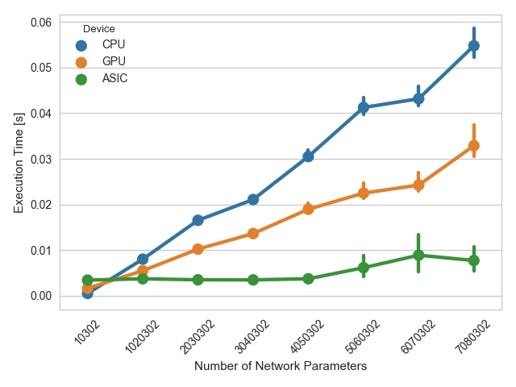

# MovidiusBenchmark

A quick and dirty benchmark to prove a point about the Movidius Neural Compute Stick.

CPU: Intel® Core™ i7-5500U CPU @ 2.40GHz × 4

GPU: GeForce GTX 950M/PCIe/SSE2

ASIC: Intel Movidius Neural Compute Stick

